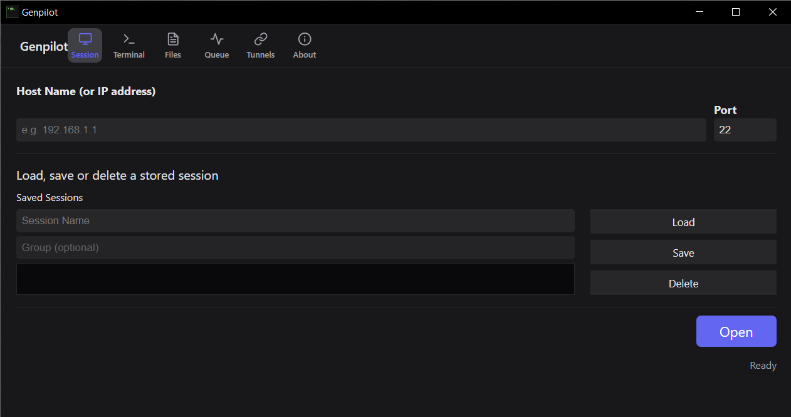

# Genpilot v4.4.0

Genpilot is a fast, secure, and user-friendly SSH/SFTP client that combines the power of Go with modern web technologies (Wails + Svelte).



## 🚀 Features

- **Advanced Terminal:** Fully interactive SSH terminal with `xterm.js` support and PuTTY-style interactive authentication.
- **SFTP File Manager:** Upload, download, and manage files with a drag-and-drop intuition.
- **Smart Transfer Queue:** Concurrent transfer control, real-time speed display, and Estimated Time of Arrival (ETA).
- **Automatic Cleanup:** Automatic deletion of incomplete files for cancelled or failed transfers.
- **SSH Tunneling (Port Forwarding):** Local port forwarding support with an easy-to-use interface.
- **Secure Session Management:** Save server information with secure local Keychain (Keyring) integration.
- **Modern UI:** Dark mode, glassmorphism design, and smooth animations.

## 🛠️ Technical Details

- **Backend:** Go (Golang)
- **Frontend:** Svelte & Vite
- **Framework:** [Wails v2](https://wails.io)
- **Terminal:** xterm.js
- **Connectivity:** crypto/ssh, pkg/sftp

## 📦 Installation and Build

### Prerequisites

- [Go](https://golang.org/dl/) (v1.21+)
- [Node.js](https://nodejs.org/en/download/) (v18+)
- [Wails CLI](https://wails.io/docs/gettingstarted/installation)

### Development Mode

```bash
wails dev
```

### Build for Production

```bash
wails build
```

## 👨‍💻 Author

**Faruk Guler**

- **GitHub:** [faruk-guler](https://github.com/faruk-guler)
- **Website:** [www.farukguler.com](https://www.farukguler.com)

## 📄 License

This project is proprietary software. All rights reserved.

---
